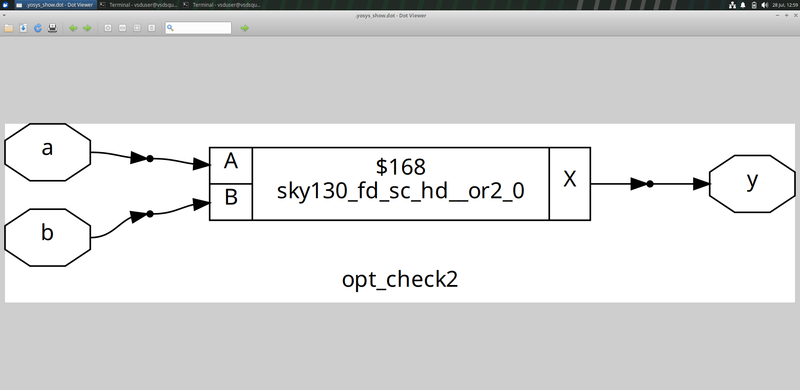

# RTL-synthesis-VSD-workshop
This is a RTL to FPGA workflow using _iverilog_, _GTKwave_ and _Yosys synthesizer_ Tool. 
This is a 10 days Project by VSDIAT.


## Day 1 : Introduction to Verilog RTL design and Synthesis

### Lab: Creating workspace for simulating the designs. 

#### Step 1: Clone the Workshop Repository
```bash
git clone https://github.com/kunalg123/sky130RTLDesignAndSynthesisWorkshop.git
cd sky130RTLDesignAndSynthesisWorkshop/verilog_files
```
#### Step 2: Install iverilog and GTKwave Tools


#### Step 3: Simulate the 2-to-4 Multiplexer.

Compile the design and testbench:
```bash
iverilog good_mux.v tb_good_mux.v
```
Run the simulation :
```bash
./a.out
```
View the waveform : 
```bash
gtkwave tb_good_mux.vcd
```


### Verilog Code Of the design.
##### Code of the design (good_mux.v) :

To install gvim use commands :
```bash
sudo apt update
sudp apt install vim.gtk3
```
Command to view the design code of 2-to-4 Mux : 
```bash
gvim tb_good_mux.v -o good_mux.v
```


## Introduction to Yosys 

#### What is Yosys ?
```
Yosys is a tool which convert the verilog HDL code into the circuit(logic) design for better visualization.
```
How Synthesis Works ? 


- Some Points to be aware of : 

```

What is Library ? (.lib)
--> A library is a collection of pre-designed and characterized logic cells (like AND, OR,flip-flops) with information about their timing, power, and area, which the synthesizer uses to map RTL code into an optimized gate-level circuit.
```
```
Why do we need slow cells?
--> Slow cells are needed to intentionally delay signals so that data from one flip-flop (FFA) doesn’t reach the next flip-flop (FFB) too early, preventing data overlap or loss.(We need slow cells to meet our delay/hold.)
```
```
Why do we need small and fast cells?
--> Small and fast cells are used where quick signal propagation is required to meet timing constraints and improve the overall speed of the circuit.(We need fast cells to meet our setup)
```
What is setup time ? 
```
Setup time means we have to give the supply before the clock changes to stabilize the input and also the circuit.
what is Tclk : Tclk is the time taken by one clk to reach to another clk. It is 1clk cycle
```

#### HDL code to Synthesized Logic design.


## Synthesis (good_mux.v)

Commands to invoke the yosys and get the logical circuit

```bash
# Invoking the yosys
yosys

# Reading the library 
read_liberty -lib ../lib/sky130_fd_sc_hd__tt_025C_1v80.lib

# Reading the Verilog file
read_verilog good_mux.v

# Using library to use the logic gates
abc -liberty ../lib/sky130_fd_sc_hd__tt_025C_1v80.lib

# To show the design created 
show

# Writing the netlist for given design
write_verilog good_mux_netlist.v

# To view the netlist using gvim
!gvim good_mux_netlist.v

# Simplyfying the netlist 
write_verilog -noattr good_mux_netlist.v

# Viewing the netlist again 
!gvim good_mux_netlist.v
```

Images of the synthesis process

Invoking the Yosys


Reading Library


Reading verilog code


Input and Output signals of the good mux


Invoking the logic design


Writing the Netlist


Netlist


Simplified Netlist


<h>

## Day 2 : Timimg libs, hierarchical vs flat synthesis and efficient flop coding style

## Timing Libraries 
### Some points to be aware of :
- tt : Typical process corner.
- 025C : Represents a temperature of 25°C, relevant for temperature-dependent performance.
- 1v80 : Indicates a core voltage of 1.8V.
This naming convention clarifies which process, voltage, and temperature conditions the library models.

### Opening and Exploring the .lib File
To open the sky130_fd_sc_hd__tt_025C_1v80.lib file :

1. __Locate the file:__
```bash
cd sky130RTLDesignAndSynthesisWorkshop/lib

# Use ls to copy the name
ls
```
2. __Open the file:__
```bash
gvim sky130_fd_sc_hd__tt_025C_1v80.lib
```
Library file 


Use the command to turnoff the syntax
```bash
# Shown in the image above
(shift) : syn off
```


### Behavioural models with _only_ logic gates and without any power port :

1. a2111o cell model : 
```bash
# In the view window add this command not in the linux window.
:sp ../my_lib/verilog_model/sky130_fd_sc_hd__a2111o.behavioural.v

# How A2111O is described:
A = AND stage.
O = OR stage (final stage).
2111 = Input distribution to the AND gates.
Interpretation of A2111O:

# There are 4 AND gates in the first stage:
1st AND gate = 2 inputs.
2nd AND gate = 1 input.
3rd AND gate = 1 input.
4th AND gate = 1 input.

The outputs of these AND gates are then fed into a single OR gate.
```


2. AND gate model 
```bash
# In the view window add this command not in the linux window.
:sp ../my_lib/verilog_model/sky130_fd_sc_hd__and2.behavioural.v
```
- AND gate comparision (and2_0 vs and2_2)


- This image shows : How the width of the gates can change the power usage and time.


## Multiple Modules Synthesis

Commands to be followed : 

```bash
# Open the verilog_file : sky130RTLDesignAndSynthesisWorkshop/verilog_files
yosys

# Read the library
read_liberty -lib ../lib/sky130_fd_sc_hd__tt_025C_1v80.lib

# Read the verilog file
read_verilog multiple_modules.v

# Invoke the synthesis command
synth -top multiple_modules

# Using library to use the logic gates
abc -liberty ../lib/sky130_fd_sc_hd__tt_025C_1v80.lib

# See the logic design of multiple modules
show multiple_modules

# Write the verilog netlist
write_verilog -noattr multiple_modules_hier.v

# View the netlist using gvim
!gvim multiple_modules_hier.v

# Writ out a flat netlist
flatten

# Write flat netlist in verilog code
write_verilog multiple_modules_flat.v

# View the flat netlist
!gvim multiple_modules_flat.v

```

To split the window in gvim window use command

```bash
# Here the file_name can be anything you want to see.
:vsp multiple_module_hier.v 
```
- Initial commands


- Multiple Modules with it's Sub Modules


- Mapping RTL (Register Transfer Level) design into a standard cell library(.lib)


- Hierarchical Design of Multiple_modules


- Netlist of Multiple Modules


- Flatten Netlist


- Flatten Logic Design


- Comparision between Hierarchical Netlist vs Flattened Netlist


## Sub Modules Synthesis

Commands to be followed : 

```bash
# Open the verilog_file : sky130RTLDesignAndSynthesisWorkshop/verilog_files
yosys

# Read the library
read_liberty -lib ../lib/sky130_fd_sc_hd__tt_025C_1v80.lib

# Read the verilog file
read_verilog multiple_modules.v

# Invoke the synthesis command
synth -top sub_module1

# Using library to use the logic gates
abc -liberty ../lib/sky130_fd_sc_hd__tt_025C_1v80.lib

# See the logic design of multiple modules
show 
```
- Sub_Module Logic Design 


## Flip-Flop Coding Styles 

Follow the commands to get the designs: 
```bash
# Open the directory
cd sky130RTLDesignAndSynthesisWorkshop/verilog_files

# Open d flip-flop files 
ls *dff*
```

### Asynchronous/Synchronous SET and RESET.

#### Asyncronous Reset _D flip-flop_

- Coding Style : 
```verilog
module dff_asyncres (input clk, input async_reset, input d, output reg q);
  always @ (posedge clk, posedge async_reset)
    if (async_reset)
      q <= 1'b0;
    else
      q <= d;
endmodule
```
Commands to be followed : 
```bash
# Run the command 
cd iverilog dff_asyncres.v tb_dff_asyncres.v

# Get the vsd file
./a.out

# Get the waveform 
gtkwave tb_dff_asyncres.vcd
```


- You can see in the second image the behaviour of the _Asynchronous Reset_. First on the clock edge our OUTPUT(Q) got HIGH but instantly we can see due to the _Reset_ our Q got _Low (0)_ again. Its because of the "Asynchronous" reset. 


### Asynchronous Set _D flip-flop_

- Coding Style : 
```verilog
module dff_async_set (input clk, input async_set, input d, output reg q);
  always @ (posedge clk, posedge async_set)
    if (async_set)
      q <= 1'b1;
    else
      q <= d;
endmodule
```
Commands to be followed : 
```bash
# Run the command 
cd iverilog dff_async_set.v tb_dff_async_set.v

# Get the vsd file
./a.out

# Get the waveform 
gtkwave tb_dff_async_set.vcd
```


- You can see in the second image the behaviour of the _Asynchronous Set_. The Output(Q) goes HIGH when set is HIGH and after that clock gets HIGH and our OUTPUT remains HIGH till our set remains HIGH. Therefore it tells us that "Asynchronous" is _Idepentent of the clock_. 
- When set is HIGH, irresprctive of clock our _Output_ will remain in the same position it was at the start of the _Asynchronous Set_ -- And once our SET is gone our OUTPUT changes based on CLOCK.


### Synchronous Reset

Coding Style : 
```verilog
module dff_syncres (input clk, input async_reset, input sync_reset, input d, output reg q);
  always @ (posedge clk)
    if (sync_reset)
      q <= 1'b0;
    else
      q <= d;
endmodule
```
Commands to be followed : 
```bash
# Run the command 
cd iverilog dff_syncres.v tb_dff_syncres.v

# Get the vsd file 
./a.out

# Get the waveform 
gtkwave tb_dff_syncres.vcd
```


- The RESET went HIGH but still our OUTPUT not getting "0" - Because the OUTPUT is waiting for clock as a stimulation and when clock goes HIGH we can see the OUTPUT goes LOW "0". This is how SYNCHRONOUS RESET behave. 


- Once we enter into "always @" Block because _Posedge_ of the clock -- Then in the _Always Block_ Reset has given the _higher Priority_ than the Clock - and our OUTPUT will remain _Low_ Until reset is Present doesn't matter if clock is High or LOw. That you can see in the image below.


## Synthesis of Syncronous/Asyncronous SET and RESET

1. Asynchronous Reset : 

Commands to be followed : 
```bash

- Asynchronous reset: Overrides clock, setting q to 0 immediately.
- Edge-triggered: Captures d on rising clock edge if reset is low.

# Open the directory 
cd sky130RTLDesignAndSynthesisWorkshop/verilog_files

# Invoke Yosys
Yosys

# Reading library
read_liberty -lib ../lib/sky130_fd_sc_hd__tt_025C_1v80.lib

# Reading Verilog file
read_verilog dff_asyncres.v

# Run Synthesis by choosing the design
synth -top dff_asyncres

# Give the dff command to only look for d flip-flops
dfflibmap -liberty ../lib/sky130_fd_sc_hd__tt_025C_1v80.lib

# Using library to use the logic gates
abc -liberty ../lib/sky130_fd_sc_hd__tt_025C_1v80.lib

# View the design using
show
```


2. Asynchronous Set : 

Commands to be followed : 
```bash

- Asynchronous set: Overrides clock, setting q to 1 immediately.

# Reading Verilog file
read_verilog dff_async_set.v

# Run Synthesis by choosing the design
synth -top dff_async_set

# Give the dff command to only look for d flip-flops
dfflibmap -liberty ../lib/sky130_fd_sc_hd__tt_025C_1v80.lib

# Using library to use the logic gates
abc -liberty ../lib/sky130_fd_sc_hd__tt_025C_1v80.lib

# View the design using
show
```


3. Synchronous Reset : 

Commands to be followed : 
```bash

- Synchronous reset: Takes effect only on the clock edge.

# Reading Verilog file
read_verilog dff_syncres.v

# Run Synthesis by choosing the design
synth -top dff_syncres

# Give the dff command to only look for d flip-flops
dfflibmap -liberty ../lib/sky130_fd_sc_hd__tt_025C_1v80.lib

# Using library to use the logic gates
abc -liberty ../lib/sky130_fd_sc_hd__tt_025C_1v80.lib

# View the design using
show
```


- We are getting the same output as we expected.


## Some special cases where _abc -liberty_ doesn't work :

1. mul2 : Run Commands in Yosys
```bash
read_liberty -lib ../lib/sky130_fd_sc_hd__tt_025C_1v80.lib

read_verilog mult_2.v

synth -top mul2

# When to not call liberty (when there is nothing to call - means when there are no cells in design from library)
abc -liberty ../lib/sky130_fd_sc_hd__tt_025C_1v80.lib

# View the design
show

# Writing Netlist
write_netlist -noattr mul2_net.v

# View the Netlist
!gvim mul2_net.v
```


- If you see here we have not used any cells or gates that's why our command didn't worked. 
- Our output has one more bit than which got appended with "zero" and input remain exact on both sides.
- Now if the relation between _a_ and _y_ is _2 x a = y_ then we just have to append one zero in the binary value of _a_ and that's our _output_. Therefore, this is what this special case shows to us. 


2. mult8 : Run Commands in Yosys
```bash

read_verilog mult_8.v

synth -top mult8

# When to not call liberty (when there is nothing to call - means when there are no cells in design from library)
abc -liberty ../lib/sky130_fd_sc_hd__tt_025C_1v80.lib

# View the design
show

# Writing Nelist
write_verilog -noattr mult_8.v

# View the Netlist
!gvim mult_8.v
```
- If you see in the white area there is written that _nuumber of cells_ 0. Which tell us that this is a special case where no cells are used and we can change the structure of design freely. 


<h>

## Day 3 : Combinational and Sequential Optimization

### Combinational Logic Optimization :

```bash
# Open the directory
cd sky130RTLDesignAndSynthesisWorkshop/verilog_files

# Open the optimization files directory 
ls *opt_check*
```

### Synthesis of opt modules

1. Opt_check 1 

Design Code :
```verilog
module opt_check (input a , input b , output y);
	assign y = a?b:0;
endmodule
```

Commands to Run Synthesis :

```bash
# Open Directory
cd sky130RTLDesignAndSynthesisWorkshop/verilog_files 

# Invoke Yosys
yosys

# Read library 
read_liberty -lib ../lib/sky130_fd_sc_hd__tt_025C_1v80.lib

# Read verilog file 
read_verilog opt_check.v

# Get the file for synthesis 
synth -top opt_check

# Executing OPT_CLEAN pass (remove unused cells and wires).
opt_clean -purge

# Using library to use the logic gates
abc -liberty ../lib/sky130_fd_sc_hd__tt_025C_1v80.lib

# View the file 
show
```
- Logic design Optimized 


2. Opt_check 2 

Design Code :
```verilog
module opt_check2 (input a , input b , output y);
	assign y = a?1:b;
endmodule
```

Commands to Run Synthesis :
```bash
# Read verilog file 
read_verilog opt_check2.v

# Get the file for synthesis 
synth -top opt_check2

# Executing OPT_CLEAN pass (remove unused cells and wires).
opt_clean -purge

# Using library to use the logic gates
abc -liberty ../lib/sky130_fd_sc_hd__tt_025C_1v80.lib

# View the file 
show
```
- Logic design Optimized 



3. Opt_check 3

Design Code :
```verilog
module opt_check3 (input a , input b, input c , output y);
  assign y = a?(c?b:0):0;
endmodule
opt_check3.v (END)

```

Commands to Run Synthesis :

```bash
# Read verilog file 
read_verilog opt_check3.v

# Get the file for synthesis 
synth -top opt_check3

# Executing OPT_CLEAN pass (remove unused cells and wires).
opt_clean -purge

# Using library to use the logic gates
abc -liberty ../lib/sky130_fd_sc_hd__tt_025C_1v80.lib

# View the file 
show
```
- Logic design Optimized 


- Explaination


4. Opt_check 4

Design Code :
```verilog
module opt_check4 (input a , input b , input c , output y);
 assign y = a?(b?(a & c ):c):(!c);
 endmodule
```

Commands to Run Synthesis :

```bash
# Read verilog file 
read_verilog opt_check4.v

# Get the file for synthesis 
synth -top opt_check4

# Executing OPT_CLEAN pass (remove unused cells and wires).
opt_clean -purge

# Using library to use the logic gates
abc -liberty ../lib/sky130_fd_sc_hd__tt_025C_1v80.lib

# View the file 
show
```
- Logic design Optimized 


5. Multiple module opt 

Design Code :
```verilog
module sub_module1(input a , input b , output y);
 assign y = a & b;
endmodule


module sub_module2(input a , input b , output y);
 assign y = a^b;
endmodule


module multiple_module_opt(input a , input b , input c , input d , output y);
wire n1,n2,n3;

sub_module1 U1 (.a(a) , .b(1'b1) , .y(n1));
sub_module2 U2 (.a(n1), .b(1'b0) , .y(n2));
sub_module2 U3 (.a(b), .b(d) , .y(n3));

assign y = c | (b & n1); 

endmodule
multiple_module_opt.v (END)
```

Commands to Run Synthesis :

```bash
# Read verilog file 
read_verilog multiple_module_opt.v

# Get the file for synthesis 
synth -top multiple_module_opt

# Flattening the design to convert the hierarchical structure into whole structure 
flatten

# --> Why we do flattening ? 
# In Yosys, flattening is used to transform a hierarchical design into a single-level netlist, which means all module instances are recursively inlined into one top-level module.

# Executing OPT_CLEAN pass (remove unused cells and wires).
opt_clean -purge

# Using library to use the logic gates
abc -liberty ../lib/sky130_fd_sc_hd__tt_025C_1v80.lib

# View the file 
show
```
- Logic design Optimized 


6. Multiple module opt2

Design Code :
```bash

```

Commands to Run Synthesis :

```bash
# Read verilog file 
read_verilog multiple_module_opt2.v

# Get the file for synthesis 
synth -top multiple_module_opt2

# Flattening the design to convert the hierarchical structure into whole structure 
flatten

# --> Why we do flattening ? 
# In Yosys, flattening is used to transform a hierarchical design into a single-level netlist, which means all module instances are recursively inlined into one top-level module.

# Executing OPT_CLEAN pass (remove unused cells and wires).
opt_clean -purge

# Using library to use the logic gates
abc -liberty ../lib/sky130_fd_sc_hd__tt_025C_1v80.lib

# View the file 
show

# Dumping Netlist 
write_verilog -noattr multiple_module_opt2_netlist.v

# View the netlist
!gvim multiple_module_opt2_netlist.v
```
- Logic Design Optimized 


- Netlist (flattened) 


### Sequential Optimization Techniques : 

Files to be used : 
```bash
# Open Directory 
cd sky130RTLDesignAndSynthesisWorkshop/verilog_files 

# Open dff_const directory
ls *dff*const*
```

### D flip-flops Constant designs behaviour : 

1. Dff_const1

Design Code : 
```verilog
module dff_const1(input clk, input reset, output reg q);
always @(posedge clk, posedge reset)
begin
  if(reset)
    q <= 1'b0;
  else
    q <= 1'b1;
end
endmodule
dff_const1.v (END)
```
Commands to Run the Verilog Files : 
```bash
# Run in iverilog 
iverilog dff_const1.v tb_dff_const1.v

# Get the vcd file 
./a.out

# See the waverform
gtkwave tb_dff_const1.vcd
```
- Waveform of dff_const1


```
Explanation :
- When Reset is 0 the Q doesn't instantly change to 1 instead it waits for the positive clock edge as given in code and then it Q becomes 1.
Even though this is an asynchronous reset, the output q waits for the positive clock edge because asynchronous behavior only occurs when reset goes high. When reset becomes 0, it doesn't trigger the always @(posedge clk or posedge reset) block. So, q doesn't update immediately — it waits for the next rising edge of clk, where the else condition runs and sets q to 1.
```

#### Synthesis of dff_const1 

Commands to follow : 
```bash
# Read Library 
read_liberty -lib ../lib/sky130_fd_sc_hd__tt_025C_1v80.lib

# Read Verilog file 
read_verilog dff_const1.v

# Do syhthesis 
synth -top dff_const1

# Mapping the dff using dfflibmap
dfflibmap -liberty ../lib/sky130_fd_sc_hd__tt_025C_1v80.lib

# View the design 
show
```

Our design has active high reset that's why synthesis given us inverter before the reset pin. You can see in the image below we have _Not_ gate attached to _Reset_.

- Design after synthesis dff_const 1


- Number of flops in design 


<h>

2. Dff_const2

Design Code : 
```verilog

module dff_const2(input clk, input reset, output reg q);
always @(posedge clk, posedge reset)
begin
  if(reset)
    q <= 1'b1;
  else
    q <= 1'b1;
end
endmodule
dff_const2.v (END)
```
Commands to Run the Verilog Files : 
```bash
# Run in iverilog 
iverilog dff_const1.v tb_dff_const2.v

# Get the vcd file 
./a.out

# See the waverform
gtkwave tb_dff_const2.vcd
```
- Waveform of dff_const2


#### Synthesis of dff_const2

Commands to follow : 
```bash
# Read Library -- If you are runnig directly after running the const1 then no need for reading library.
read_liberty -lib ../lib/sky130_fd_sc_hd__tt_025C_1v80.lib

# Read Verilog file 
read_verilog dff_const2.v

# Do syhthesis 
synth -top dff_const2

# Mapping the dff using dfflibmap
dfflibmap -liberty ../lib/sky130_fd_sc_hd__tt_025C_1v80.lib

# View the design 
show
```

As our Q is always one, there was no need to use any flop in the design and that's why our design has no cells used from library.

- Design after synthesis


- Number of flops in design 


<h>

3. dff_const 3

Design Code : 
```verilog
module dff_const3(input clk, input reset, output reg q);
reg q1;

always @(posedge clk, posedge reset)
begin
        if(reset)
        begin
                q <= 1'b1;
                q1 <= 1'b0;
        end
        else
        begin
                q1 <= 1'b1;
                q <= q1;
        end
end

endmodule
dff_const3.v (END)

```
Commands to Run the Verilog Files : 
```bash
# Run in iverilog 
iverilog dff_const1.v tb_dff_const3.v

# Get the vcd file 
./a.out

# See the waverform
gtkwave tb_dff_const3.vcd
```
- Waveform of dff_const3


#### Synthesis of dff_const3

Commands to follow : 
```bash
# Read Library -- If you are runnig directly after running the const1 then no need for reading library.
read_liberty -lib ../lib/sky130_fd_sc_hd__tt_025C_1v80.lib

# Read Verilog file 
read_verilog dff_const3.v

# Do syhthesis 
synth -top dff_const3

# Mapping the dff using dfflibmap
dfflibmap -liberty ../lib/sky130_fd_sc_hd__tt_025C_1v80.lib

# View the design 
show
```
- Synthesis Design dff_const 3


- Design explanation 


- Number of flops in the design 


<h>

4. dff_const 4

```
Every commands for next two designs (const4 and const5) and synthesis will be as same as we did for all the dff_constants. 
```
Design Code : 
```verilog
module dff_const4(input clk, input reset, output reg q);
reg q1;

always @(posedge clk, posedge reset)
begin
        if(reset)
        begin
                q <= 1'b1;
                q1 <= 1'b1;
        end
        else
        begin
                q1 <= 1'b1;
                q <= q1;
        end
end

endmodule
dff_const4.v (END)
```
- Waveform for dff_count4


- Present flops in the circuit are 0. 


- Synthesis Image for dff_const4


<h>

4. dff_const 5

Design Code : 
```verilog
module dff_const5(input clk, input reset, output reg q);
reg q1;

always @(posedge clk, posedge reset)
begin
        if(reset)  // Only one the posedge of the reset our reset will work.
        begin      // When reset becomes 0, our Q will change only when there is clk posedge.
                q <= 1'b0;
                q1 <= 1'b0;
        end
        else
        begin
                q1 <= 1'b1;
                q <= q1;
        end
end

endmodule
dff_const5.v (END)

```
- Waveform for dff_count5


- Present flops in the circuit are 0. 


- Synthesis Image for dff_const5


### Sequential Optimization for unused output

1. Counter_opt.v 

- Synthesis 

```bash 
# Open Directory 
cd sky130RTLDesignAndSynthesisWorkshop/verilog_files

# Invoke Yosys
yosys

# Read Library 
read_liberty -lib ../lib/sky130_fd_sc_hd__tt_025C_1v80.lib

# Read Verilog Code of design
read_verilog counter_opt.v

# Doing synthesis of design 
synth -top counter_opt

# Finding the D-flip-flop from library for design
dfflibmap -liberty ../lib/sky130_fd_sc_hd__tt_025C_1v80.lib

# 
abc -liberty ../lib/sky130_fd_sc_hd__tt_025C_1v80.lib

# View the synthesized design 
show
```

- Number of flops getting used 


- Counter 1 optimized design using only one DFF. 


```bash
# Open directory 
cd sky130RTLDesignAndSynthesisWorkshop/verilog_files

# Copy the code of counter_opt.v to new file named counter_opt2.v 
cp counter_opt.v counter_opt2.v

# open the new file and edit it
gvim counter_opt2.v

# Edit the file as shown in images below
```
- Previous code :


- Edited code (changes made = assign values changed / only one line changed)
```
To save edited content : Esc --> :w + enter = saved 
```


- Run synthesis 

```bash
# Invoke yosys in verilog_files
yosys

# Read the library 
read_liberty -lib ../lib/sky130_fd_sc_hd__tt_025C_1v80.lib

# Read verilog code (edited)
read_verilog counter_opt2.v

# Do synthesis on the module -- we changed file name but our module remains same. 
synth -top counter_opt 

# Map the synthesized design using actual gates from the library described as (.lib)
abc -liberty ../lib/sky130_fd_sc_hd__tt_025C_1v80.lib

# View the disign 
show
```

- Number of flops getting used in circuit


- Unlike in previous design every flop is getting used here 


## Day 4 : 